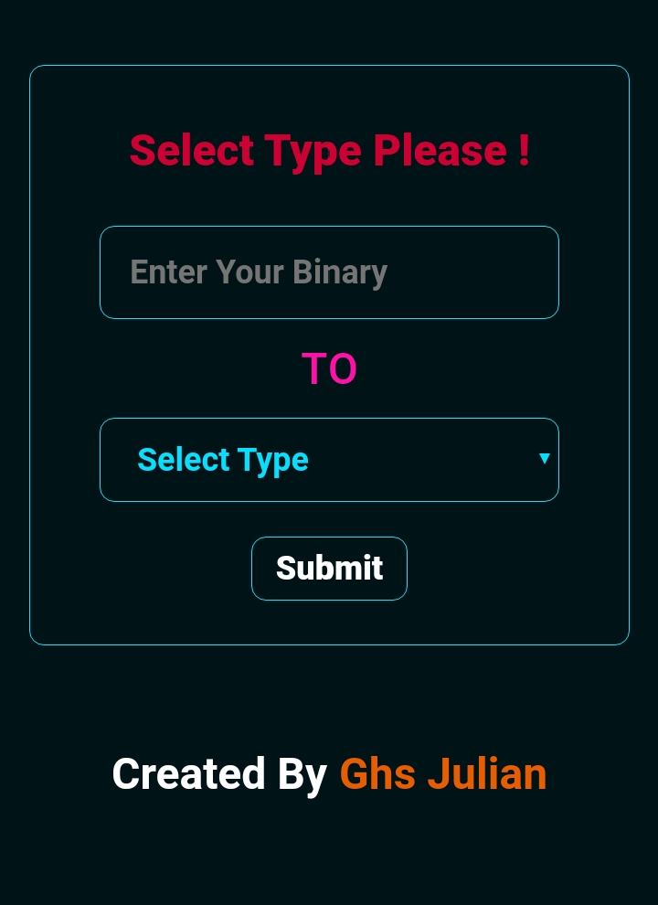
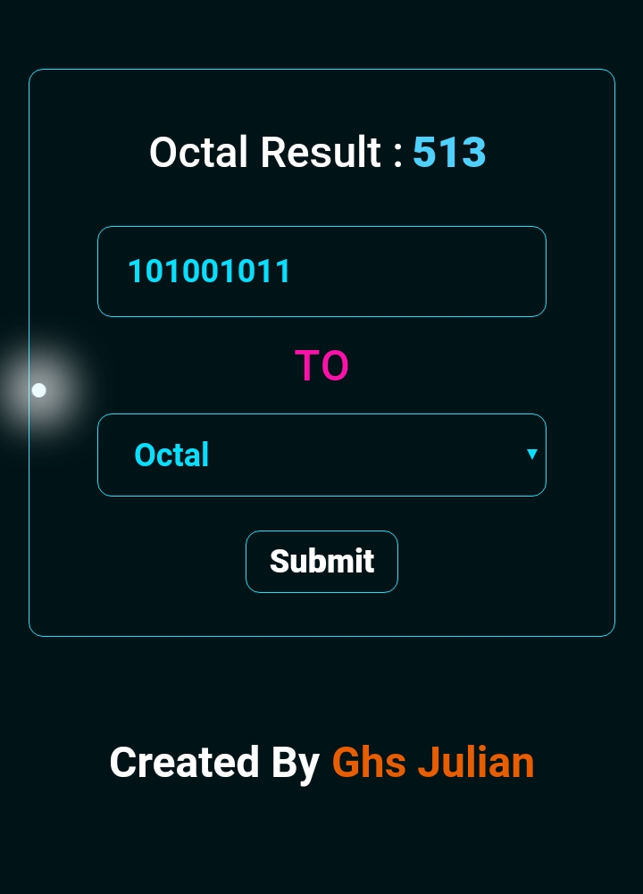

# Developer Ghs Julian 

## Binary Converter 

#### This Repository Is A An Awesome Really , I Made This Repo For Solving The Binary Hexadecimal, Decimal , Octal , And Binary.

## Live Demo :--
https://ghsjulian.github.io/Binary-Converter/

## Demo & Screenshots : 

  
    
  
  

